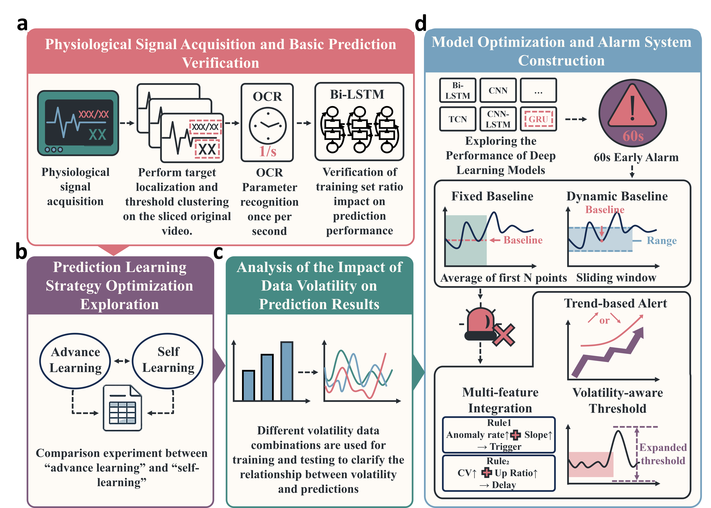
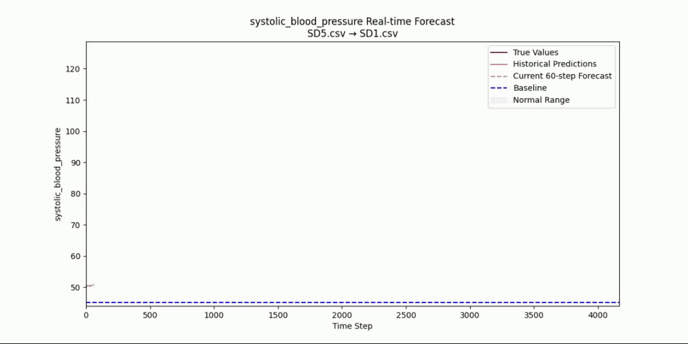

# Intelligent Alarm System for Anesthesia Monitoring

A deep learning-based system for real-time prediction and intelligent alarming of vital signs during anesthesia. Supports automatic model selection, multi-mode alarms, and false alarm self-optimization, providing intelligent solutions for laboratory animal monitoring.

## System Architecture


The system consists of four core modules:
1. **Data processing module**: OCR extracts physiological data and standardizes it.
2. **Model selection module**: Automatically selects the optimal solution from eight candidate models.
3. **Alarm mode module**: Supports fixed baseline (stable state) and dynamic baseline (trend detection).
4. **Self-optimization module**: Analyzes false alarm characteristics and recommends optimization strategies.

## Real-time prediction illustration


## Quick start

### Environment configuration
```bash
# Install dependencies
pip install -r requirements.txt

Run process
Start OCR service: Extract physiological data
bash
python scripts/run_ocr_service.py


Automatic model selection: Train and select the optimal model based on OCR output data
bash
python scripts/run_model_pipeline.py

Start the alarm system: Select the alarm mode (fixed/dynamic baseline)
bash
# Fixed baseline mode
python scripts/run_alarm_system.py --mode fixed
# Dynamic baseline mode
python scripts/run_alarm_system.py --mode dynamic

Directory description
data/: Input data and processing results
data_processing/: OCR data extraction and preprocessing
models/: Deep learning model implementation
model_selection/: Automatic model selection and hyperparameter optimization
detection/: Implementation of two alarm modes
optimization/: False alarm analysis and self-optimization strategy
scripts/: System startup scripts
Paper-related
Supplementary materials:
